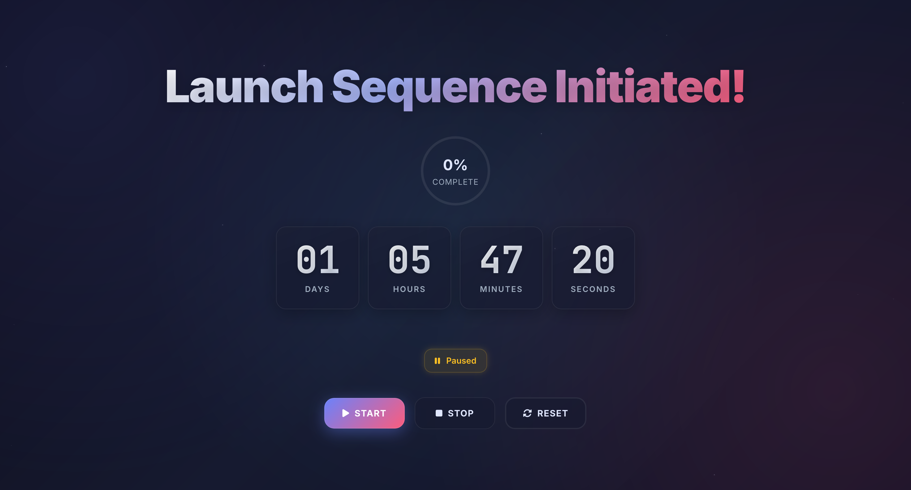

# Celestial Countdown - Daily UI #005

An immersive Celestial Countdown timer featuring a stunning cosmic theme, smooth animations, interactive controls, and a dynamic progress ring. Designed and developed as part of the Daily UI challenge.



## Live Demo

Experience the live version of the current component here:
**[https://toprakdeviren.github.io/05-celestial-countdown/](https://toprakdeviren.github.io/05-celestial-countdown/)**


## Features

- **Interactive Countdown**: Displays days, hours, minutes, and seconds with smooth value transitions.
- **Dynamic Progress Ring**: Visually represents the countdown's completion percentage with a gradient fill.
- **Full Timer Controls**: Easy-to-use Start, Stop, and Reset functionality.
- **Stunning Cosmic Theme**: Immersive space-themed background with subtle particle animations and gradient nebulas.
- **Smooth UI Animations**: Engaging transitions for timer values, UI elements appearing, and button interactions.
- **Status Indicator**: Clearly shows if the timer is running, paused, or has completed.
- **User Notifications**: Provides feedback for actions like timer reset or completion.
- **Responsive Design**: Adapts gracefully to various screen sizes, from desktop to mobile.
- **Keyboard Shortcuts**: Control the timer efficiently using 'Space' (Start/Stop) and 'R' (Reset).
- **Accessibility Considerations**: Focus states for interactive elements.

## Technologies Used

- **HTML5**: Semantic markup for structure.
- **CSS3**:
    - **Tailwind CSS**: For rapid UI development and utility classes.
    - **Custom CSS (`style.css`)**: For bespoke styling, animations, cosmic theme, and glassmorphism effects.
- **JavaScript (ES6+)**:
    - Object-Oriented approach with a `CountdownTimer` class.
    - DOM manipulation for dynamic updates.
    - Event handling for user interactions.
- **SVG**: For the dynamic progress ring.
- **Font Awesome**: For iconography.
- **Google Fonts**: For typography (Inter & JetBrains Mono).

## Development

This project is built around a `CountdownTimer` JavaScript class that encapsulates all core logic:

- **State Management**: Tracks the timer's current state (initial time, target time, running status).
- **UI Updating**: Handles the dynamic display of time segments and the progress ring.
- **Event Handling**: Manages interactions from control buttons and keyboard shortcuts.
- **Progress Calculation**: Dynamically calculates and updates the SVG progress ring's `stroke-dashoffset`.
- **Particle Effects**: Generates and animates background particles for the cosmic theme.
- **Notification System**: Displays temporary messages for key events.

## Usage

Clone the repository and open `index.html` in your web browser. Alternatively, you can serve it locally:

```bash
# Example using npm's http-server (if installed globally)
# npm install -g http-server
# http-server

# Or using Python's built-in server (Python 3)
python -m http.server
```

## Credits

Designed and developed by [Uğur Toprakdeviren](https://github.com/toprakdeviren).

This project is part of the [Celestial Countdown](https://github.com/toprakdeviren/05-celestial-countdown) collection, an ongoing series of Daily UI challenges.

## License

MIT License - feel free to use, modify, and learn from this project.
